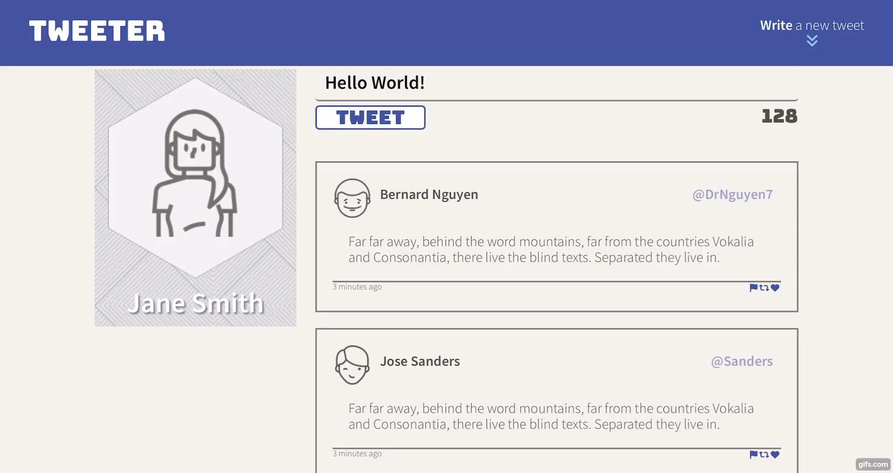

# Tweeter Project

Tweeter is a simple, single-page Twitter clone. The main page displays a tweet feed and has the ability for the user to post new tweets.

This app is powered by the following technologies:

#### Front-End

- HTML
- CSS
- Javascript
- AJAX
- jQuery

#### Back-End

- Express
- Node

## Features

- User can post new tweets and will remain in the feed unless server is restarted.
- Dynamic page design that will load new tweets without refreshing the page. This is done aynschronously using AJAX and jQuery.
- Features element animations using jQuery and CSS for added user experience.
- Follows responsive web design principle and supports various screen sizes (Mobile, Tablet, Desktop, TV).

## Notes

- Tweet must be between 1 - 140 characters, otherwise an error prompt will show. A character counter is displayed and will update as you type.
- Tweet composer is hidden by default on tablet and desktop mode and displayed on page load for mobile users. To toggle tweet composer, click on the 'Write a new tweet' button.
- If the user will scroll down by 500pixels, a handy scroll-to-top button will appear at the bottom right of the page to allow our user to jump back to the top of the page without having to scroll all the way back up.

|  |
|:--:| 

## App Screenshots

|  | 
|:--:| 
| Homepage (Desktop view) |

|  | 
|:--:| 
| Homepage (condensed view: Tablet mode) |

|  | 
|:--:| 
| Homepage (condensed view: Smartphone mode) |

## Getting Started

1. Install dependencies using the `npm install` command.
2. Start the web server using the `npm run local` command. The app will be served at <http://localhost:8080/>.
3. Go to <http://localhost:8080/> in your browser.

## Dependencies

- Express
- Node 5.10.x or above
- body-parser
- chance
- express
- md5

## Footnote

This project was created and published by [Jerome Lagbas](https://github.com/jeromealmir) as part of the Web Development program at Lighthouse Labs.